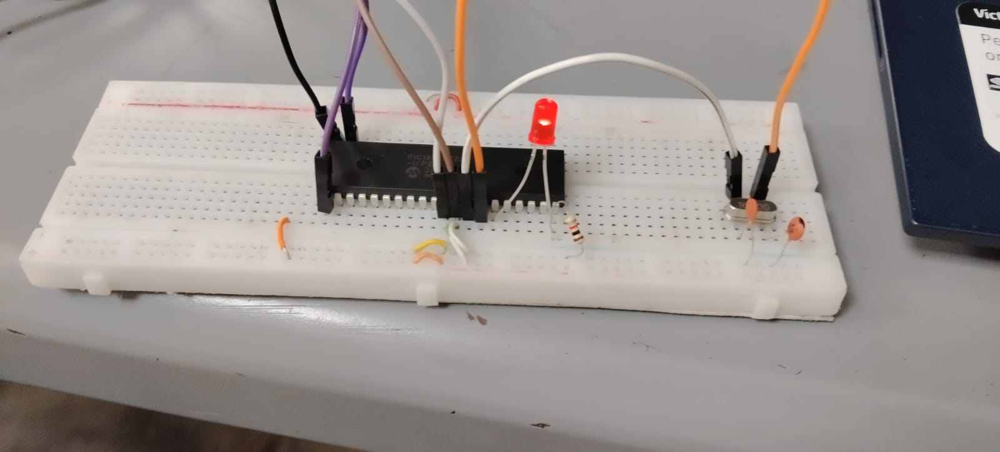

# Lab02 - Caracterización de osciladores (externo vs. interno)

## 1. Integrantes
 *[Andrés Felipe Muñoz Martinéz](https://github.com/Andresfmm2007)

 *[Paula Andrea Cortés Espinosa](https://github.com/Cortes271)

 *[Samuel Corro Pedrozo](https://github.com/SamuelCorro)

## 2. Documentación

En este laboratorio se analizó el funcionamiento de los osciladores interno y externo del microcontrolador PIC18F45K22. Se programó el sistema para generar una señal periódica y medir su frecuencia utilizando un osciloscopio. Con los resultados obtenidos se comparó la precisión y estabilidad de ambos osciladores, observando que el oscilador externo ofrece mayor exactitud, mientras que el oscilador interno es más simple de implementar al no requerir componentes adicionales.
### 2.1 Descripción del laboratorio
Los microcontroladores requieren una señal de reloj para sincronizar la ejecución de instrucciones y el funcionamiento de los periféricos internos. Esta señal es generada por un oscilador, el cual define la velocidad a la que trabaja el sistema.

Existen dos tipos principales de osciladores en los microcontroladores:

-Oscilador externo, que utiliza componentes externos como un cristal de cuarzo o un circuito RC.

-Oscilador interno, integrado dentro del microcontrolador.

En este laboratorio se analiza el comportamiento de ambos tipos de osciladores utilizando el microcontrolador PIC18F45K22, comparando su frecuencia, precisión y estabilidad ante variaciones como cambios de temperatura.

### 2.3 Análisis y comparación

#### Tabla 1: Medición en frío

| Modo de oscilador | Freq. teórica Fosc | RA6 medible (CLKO)? | Freq. medida RA6 (Hz) | Freq. teórica RC0 (Hz)| Freq. medida RC0 (Hz) | Error RC0 (%) |  
|------------------|------------------|---------------------|---------------|---------------------|---------------|---------------|
| INTOSC (interno) | 16,000,000       |  Sí                 |   500,023            |                500                 |        500.02     |     -0,004    | | 501
| HS (cristal externo 16 MHz) | 16,000,000 | No |     NA      |     500               |        500.00      | -0.000              |
| RC externo       | ~16,000,000*     | No                                    |       N/A        | 500                 |        498.75     |        -0.250       | |

**Análisis tabla 1:** En condiciones de frío, el osiclador externo (HS) presenta la mayor presición con **0%** de margen de error. El osilador interno INTOSC muestra una desviacion minima de **0.004%** mientras que el RC externo tiene un error del **0.25%** indicando que su frecuencia real esta por debajo de la teorica 

#### Tabla 2: Medición con calor

| Modo de oscilador | Freq. teórica Fosc | RA6 medible (CLKO)? | Freq. medida RA6 (Hz) | Freq. teórica RC0 (Hz)| Freq. medida RC0 (Hz) | Error RC0 (%) |  
|------------------|------------------|---------------------|---------------|---------------------|---------------|---------------|
| INTOSC (interno) | 16,000,000       | Sí                 |     498,456                |                500                 |      498.46         |       -0.308        | |
| HS (cristal externo 16 MHz) | 16,000,000 | No |     NA      |               500                 |      499.99         |         -0.002      |
| RC externo       | ~16,000,000*     | No                                    |       N/A        | 500                 |        495.20       |     -0.960          | |

**Análisis tabla 2**: Al aplicar calor todos los osicladores presentan una disminución en la frecuencia INTOSC se desvía **-0.308%**, el HS mantiene una buena estabilidad con solo **-0.002** de error. mientras que el RC externo es el mas afectado con un error de **-0,96%** demostrando alta sesibilidad térmica

#### Tabla 3: Deriva

| Modo de oscilador |RC0 deriva (Hz) |
|------------------|--------------------|
| INTOSC (interno) |     -1.56               |                
| HS (cristal externo 16 MHz) |     -0.01           |                |
| RC externo       |     -3.55            |                

**Análisis tabla 3:**La deriva térmica (diferencia entre frio y calor) confirma que el cristal externo HS es el mas estable con solo un **0.01**Hz de variacion. El INTOSC presenta una deriva moderada de **1.56** Hz, mientras que el RC externo es el mas inestable con **3.55** Hz de desviación 

#### Tabla 4: Medición en frío con PLL

| Modo de oscilador | Freq. teórica Fosc | Freq. con PLL | RA6 medible (CLKO)? | Freq. medida RA6 (Hz) | Freq. teórica RC0 (Hz)| Freq. medida RC0 (Hz) | Error RC0 (%) |  
|------------------|------------------|---------------------|---------------|---------------------|---------------|---------------|---------------|
| INTOSC (interno) | 16,000,000       | 64,000,000 |  Sí                 |   2,000,092           |                500                 |        500.09     |     0,018    | | 
| HS (cristal externo 16 MHz) | 16,000,000 | 64,000,000 | No |     NA      |     500               |        500.00      | 0.000              |
| RC externo       | ~16,000,000*     | 64,000,000 | No                                    |       N/A        | 500                 |        498.70     |        -0.260       | |

**Análisis tabla 4:** Con PLL activado en frío, los errores se multiplican proporcionalmente. El INTOSC aumenta su error a**0,018%**, El HS se mantiene perfecto, y el RC externo se mantiene en **0.26%** similar a su comportamiento sin PLL

#### Tabla 5: Medición con calor y PLL (x4)

| Modo de oscilador | Freq. teórica Fosc |Freq. con PLL | RA6 medible (CLKO)? | Freq. medida RA6 (Hz) | Freq. teórica RC0 (Hz)| Freq. medida RC0 (Hz) | Error RC0 (%) |  
|------------------|------------------|---------------------|---------------|---------------------|---------------|---------------|---------------|
| INTOSC (interno) | 16,000,000       |64,000,000 | Sí                 |    1,993,824                |                500                 |      498.46         |       -0.308        | |
| HS (cristal externo 16 MHz) | 16,000,000 |64,000,000 | No |     NA      |               500                 |      499.98         |         -0.004      |
| RC externo       | ~16,000,000*     | 64,000,000 |No                                    |       N/A        | 500                 |        494.85       |     -1.030          | |

**Análisis tabla 5**: con calor y PLL, el patrón se mantiene pero los errores se amplifican. El INTOSC mantiene **0.308%**, el HS es casi perfecto con **0.004** y el RC externo empeora a  **1,03%** siendo el menos recomendable para aplicaciones de presición en condiciones variables 

#### Tabla 3: Deriva con PLL

| Modo de oscilador |RC0 deriva con PLL (Hz) |
|------------------|--------------------|
| INTOSC (interno) |     -1.63               |                
| HS (cristal externo 16 MHz) |     -0.02           |                |
| RC externo       |     -3.85            |                

**Análisis tabla 3:**La deriva con PLL confirma la tendencis; el HS es el mas estable **0.02**Hz. El INTOSC presenta una deriva moderada de **1.63** Hz, mientras que el RC externo es el mas inestable con **3.85** Hz. El PLL amplifica ligeramente las derivas existentes

## 2.4 Diagramas

## 2.5 Formas de onda

### INTOSC (interno) 

### HS

## RC

## 3. Evidencias de implementación

### INTOSC (interno) 

### HS
  
## RC

## 4. Preguntas

#### ¿En qué modo se obtuvo la medición más cercana a la frecuencia teórica?

- El modo HS utilizando un cristal externo de 16 MHz fue el que presentó la frecuencia más próxima al valor teórico. Esto se debe a que los osciladores basados en cristal ofrecen mayor estabilidad y exactitud en comparación con el oscilador interno o el oscilador RC externo.

####  ¿Fue posible evidenciar el fenómeno de deriva? ¿Qué factores podrían explicar la variación de frecuencia al calentar el PIC?

- Se logró observar el fenómeno de deriva al comparar las mediciones tomadas a temperatura ambiente con aquellas realizadas al aplicar calor. Esta variación ocurre porque las características eléctricas de los componentes cambian con la temperatura. Los osciladores internos y RC son más sensibles a estos cambios, mientras que el cristal externo mantiene una frecuencia más estable.

####  ¿Cuál es más preciso en cuanto a frecuencia teórica vs. medida?
- El oscilador configurado en modo HS con cristal externo resultó ser el más preciso, ya que mostró la menor diferencia entre la frecuencia esperada y la obtenida en las mediciones. Esto evidencia una mayor estabilidad frente a otras opciones de oscilación como el oscilador interno o el RC externo.

#### Explique cómo usar RC0 para estimar la frecuencia del oscilador cuando RA6 no está disponible.
- Si el pin *RA6* no se puede utilizar para observar la señal CLKO, es posible emplear el pin RC0 generando una señal periódica mediante retardos que dependan del reloj del microcontrolador. Al medir la frecuencia de esa señal generada y compararla con la frecuencia esperada según los retardos programados, se puede estimar la frecuencia real del oscilador del PIC.
#### Si se quisiera duplicar la frecuencia del PIC usando PLL, ¿en qué modos se podría aplicar?

El uso del PLL para multiplicar la frecuencia puede implementarse en los modos INTOSC y HS, ya que ambos proporcionan una señal de reloj lo suficientemente estable para ser amplificada. Por otro lado, el modo RC externo no es recomendable para aplicar PLL debido a su baja precisión y estabilidad en la frecuencia.

#### Enliste ventajas y desventajas de cada modo.
|Modo de oscilador|Ventajas  |Desventajas|
|-------------------|--|--------------|
|INTOSC (oscilador interno)|No necesita componentes externos para funcionar.   Permite reducir el costo y el tamaño del circuito.   Su configuración en el microcontrolador es la mas sencilla..|Menor precisión que un cristal.   La frecuencia puede cambiar con variaciones de temperatura y voltaje.   Mayor deriva de frecuencia.|
|HS (cristal externo)|Muy alta precisión y estabilidad.   La frecuencia obtenida es muy cercana al valor teórico.   Presenta menor variación frente a cambios de temperatura.|Requiere cristal y condensadores externos.   Incrementa el costo y el espacio utilizado en la placa. 
|RC externo|Implementación sencilla con resistencia y condensador.   Los componentes utilizados son económicos..|Muy baja precisión.   La frecuencia puede variar considerablemente debido a la temperatura y la tolerancia de los componentes.   Frecuencia difícil de controlar con exactitud.|
